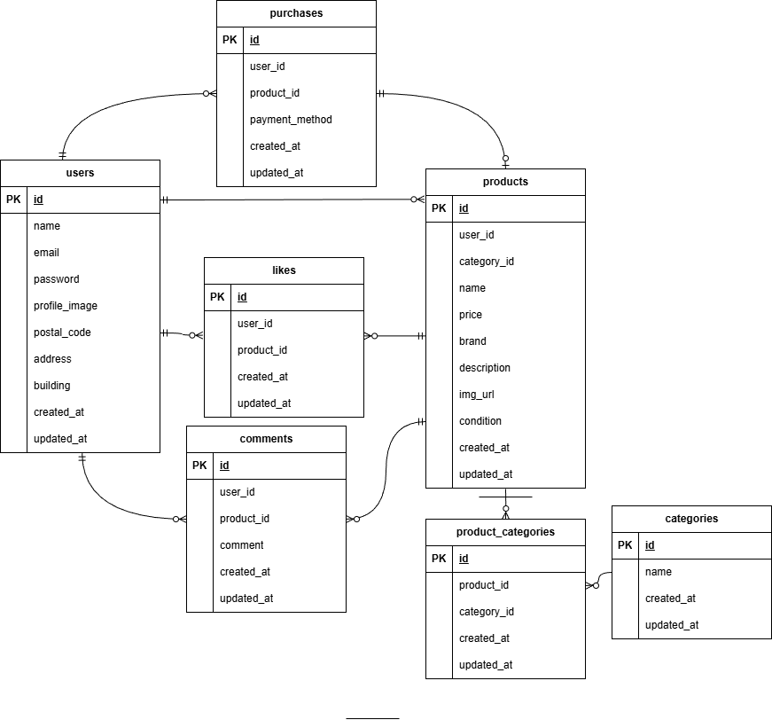

# coachTechフリマ

coachTechフリマは、ある企業が開発した独自のフリマアプリです。

ユーザーは商品を出品したり、購入したりすることができる、フリマアプリです。

## 環境構築

# dockerビルド
- docker-compose up -d --build
- docker run -d -p 1025:1025 -p 8025:8025 mailhog/mailhog

# Laravel環境構築
- docker-compose exec php bash
- composer -vこれでインストールできているか確認してください。
- composer installインストールできていない場合はこのコマンドでインストールして ください。
- cp .env.example .env
.envの中の設定

    DB_HOST=mysql

    DB_DATABASE=laravel_db

    DB_USERNAME=laravel_user

    DB_PASSWORD=laravel_pass

    MAIL_HOST=host.docker.internal

    MAIL_FROM_ADDRESS=Furima@example.com

    MAIL_FROM_NAME="Furima app"

    **Stripe API Key**: [Stripe Dashboard](https://dashboard.stripe.com/test/apikeys)からテスト用のAPIキーを取得してください。

    **.envに追加**

    STRIPE_KEY=取得した公開可能APIキーをペースト　　

    STRIPE_SECRET=取得したシークレットAPIキーをペースト　　

- php artisan key:generate
- php artisan migrate
- php artisan db:seed
# テスト
- cp .env .env.testing
- php artisan key:generate --env=testing
- .env.testingの中の設定

    APP_ENV=testing

    DB_CONNECTION=sqlite

    DB_DATABASE=:memory:

    CACHE_STORE=array

    QUEUE_CONNECTION=sync

    SESSION_DRIVER=array

. テスト実行
- php artisan test --filter=テスト名

## 使用技術（実行環境）
- Laravel 8.83.29
- PHP 8.1.34
- MySQL 8.0.26
- nginx 1.21.1

## 一般ユーザーのログイン情報
- Email: user@example.com
- Password: password123

※このログイン情報でログインしたときメール認証はされていないのでマイページをクリックすると認証誘導画面がでますので、認証はこちらをクリックしてください。
また、ユーザーアイコンはデフォルト画像でないのでプロフィールを編集で更新するとデフォルトになります。

## ER図

## URL
- 開発環境:http://localhost/
- データベース:http://localhost:8080